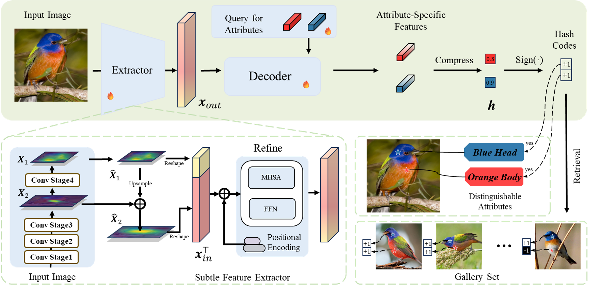
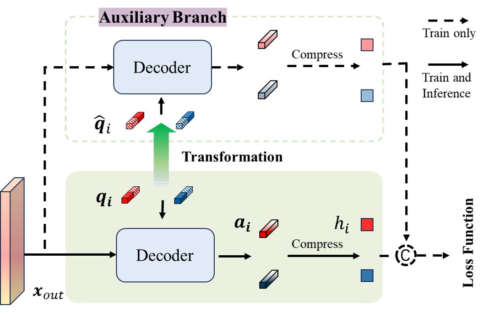

# Learning Attribute-Aware Hash Codes for Fine-Grained Image Retrieval via Query Optimization

## Method

  

Overall framework of our method for generating attribute-aware hash codes for fine-grained image retrieval. The top part of the figure shows the workflow of the method: given a group of learnable parameters, an image is decoupled into a set of visual attributes, and each attribute is compressed into a single bit, serving as the hash code for retrieval. The bottom left part details the implementation of the Subtle Feature Extractor, where MHSA stands for multi-head self-attention and FFN stands for feed-forward network. The bottom right part illustrates our motivation for using distinctive attributes as hash codes for retrieval.

  

Building on the query-based optimization framework, we incorporate an auxiliary branch to help alleviate the challenges of complex landscape optimization often encountered with low-bit hash codes.

## Environment
- Python 3.8.5
- Pytorch 1.10.0
- torchvision 0.11.1
- numpy 1.24.4

## Usage
- Before training, please specify the dataset path in `set_config.py`.
- You can start training by running `python run.py`.

#### About
This repository contains code modified from [Facebook Research's DETR](https://github.com/facebookresearch/detr).
Original License: [LICENSE](https://github.com/facebookresearch/detr/blob/main/LICENSE)
